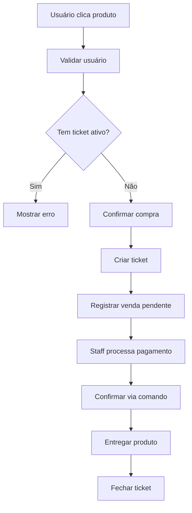
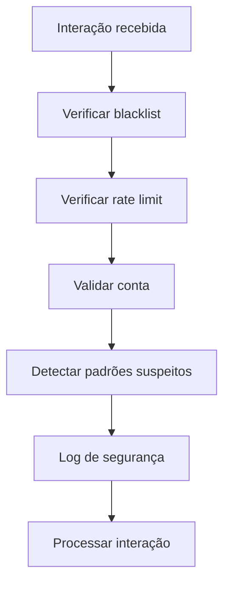

# 📚 Documentação Técnica - Bot Discord de Tickets e Vendas

## 🏗️ Arquitetura do Sistema

### Visão Geral
O bot utiliza uma arquitetura modular baseada em managers especializados, garantindo separação de responsabilidades e facilidade de manutenção.

```
┌─────────────────┐    ┌──────────────────┐    ┌─────────────────┐
│   Discord API   │◄──►│   Bot Principal  │◄──►│  Base de Dados  │
└─────────────────┘    └──────────────────┘    └─────────────────┘
                                │
                ┌───────────────┼───────────────┐
                │               │               │
        ┌───────▼──────┐ ┌──────▼──────┐ ┌─────▼──────┐
        │ TicketManager│ │ProductManager│ │SecurityMgr │
        └──────────────┘ └─────────────┘ └────────────┘
```

### Componentes Principais

#### 1. SecurityManager (`src/security/SecurityManager.js`)
**Responsabilidades:**
- Criptografia AES-256-CBC para conteúdo digital
- Rate limiting por usuário
- Blacklist automática e manual
- Verificação de integridade do código
- Logs de segurança em tempo real

**Métodos Principais:**
```javascript
encrypt(text)                    // Criptografar dados
decrypt(encryptedText)          // Descriptografar dados
validateInteraction(interaction) // Validar interações
checkRateLimit(userId)          // Verificar rate limit
blacklistUser(userId, reason)   // Adicionar à blacklist
```

#### 2. DatabaseManager (`src/database/DatabaseManager.js`)
**Responsabilidades:**
- Gerenciamento do SQLite
- ORM customizado
- Migrations automáticas
- Limpeza de dados antigos

**Tabelas:**
- `users` - Dados dos usuários
- `tickets` - Sistema de tickets
- `products` - Produtos digitais (30 slots)
- `sales` - Transações de venda
- `security_logs` - Logs de segurança
- `settings` - Configurações do bot

#### 3. TicketManager (`src/managers/TicketManager.js`)
**Responsabilidades:**
- Criação de tickets únicos por usuário
- Gerenciamento de canais privados
- Auto-fechamento por inatividade
- Sistema de transcrições
- Controle de permissões

**Fluxo de Ticket:**
```
Usuário clica produto → Validação → Criação canal → Configuração permissões → Timeout automático
```

#### 4. ProductManager (`src/managers/ProductManager.js`)
**Responsabilidades:**
- Gerenciamento de 30 slots de produtos
- Interface visual com botões
- Controle de estoque
- Entrega automática de produtos digitais
- Criptografia de conteúdo

## 🔒 Sistema de Segurança

### Criptografia
```javascript
// AES-256-CBC com IV aleatório
const cipher = crypto.createCipher('aes-256-cbc', encryptionKey);
const iv = crypto.randomBytes(16);
```

### Rate Limiting
```javascript
// Configurações por tipo
commands: 5 requests/60s
tickets: 1 request/5min
interactions: 10 requests/60s
```

### Verificações de Segurança
1. **Contas novas** - Detecta contas < 7 dias
2. **Bots** - Bloqueia interações de bots
3. **Padrões suspeitos** - Monitora comportamento anômalo
4. **Integridade** - Verifica hash do código a cada 5min

## 📊 Base de Dados

### Schema Principal

```sql
-- Usuários
CREATE TABLE users (
    id TEXT PRIMARY KEY,
    username TEXT NOT NULL,
    total_tickets INTEGER DEFAULT 0,
    total_purchases INTEGER DEFAULT 0,
    is_blacklisted INTEGER DEFAULT 0
);

-- Tickets
CREATE TABLE tickets (
    id INTEGER PRIMARY KEY AUTOINCREMENT,
    channel_id TEXT UNIQUE NOT NULL,
    user_id TEXT NOT NULL,
    product_id INTEGER,
    status TEXT DEFAULT 'open',
    created_at INTEGER NOT NULL
);

-- Produtos (30 slots)
CREATE TABLE products (
    id INTEGER PRIMARY KEY AUTOINCREMENT,
    name TEXT NOT NULL,
    price REAL NOT NULL,
    image_url TEXT,
    digital_content TEXT, -- Criptografado
    stock_quantity INTEGER DEFAULT -1,
    is_active INTEGER DEFAULT 1
);
```

### Índices de Performance
```sql
CREATE INDEX idx_tickets_user_id ON tickets (user_id);
CREATE INDEX idx_tickets_status ON tickets (status);
CREATE INDEX idx_sales_user_id ON sales (user_id);
CREATE INDEX idx_security_logs_event_type ON security_logs (event_type);
```

## 🔄 Fluxos de Processo

### Fluxo de Compra


### Fluxo de Segurança


## 🛠️ APIs e Integrações

### Discord.js v14
```javascript
// Configuração do cliente
const client = new Client({
    intents: [
        GatewayIntentBits.Guilds,
        GatewayIntentBits.GuildMessages,
        GatewayIntentBits.MessageContent,
        GatewayIntentBits.GuildMembers
    ]
});
```

### Comandos Slash
```javascript
// Estrutura de comando
module.exports = {
    data: new SlashCommandBuilder()
        .setName('comando')
        .setDescription('Descrição'),
    async execute(interaction) {
        // Lógica do comando
    }
};
```

## 📈 Monitoramento e Logs

### Sistema de Logs
```javascript
// Níveis de log
logger.info()     // Informações gerais
logger.warn()     // Avisos
logger.error()    // Erros
logger.security() // Eventos de segurança
logger.debug()    // Debug (apenas desenvolvimento)
```

### Métricas Importantes
- **Tickets criados/fechados por dia**
- **Vendas completadas/pendentes**
- **Eventos de segurança**
- **Performance do banco de dados**
- **Rate limits atingidos**

## 🔧 Configuração Avançada

### Variáveis de Ambiente
```env
# Performance
RATE_LIMIT_REQUESTS=5
RATE_LIMIT_WINDOW_MS=60000
TICKET_TIMEOUT_HOURS=24

# Segurança
MAX_TICKETS_PER_USER=1
AUTO_CLOSE_INACTIVE_TICKETS=true
REQUIRE_PAYMENT_CONFIRMATION=true
```

### Otimizações
1. **Cache de produtos** - Produtos em memória para acesso rápido
2. **Pool de conexões** - SQLite com WAL mode
3. **Cleanup automático** - Limpeza de dados antigos
4. **Compressão de logs** - Rotação automática

## 🚀 Deploy e Produção

### Requisitos de Sistema
- **RAM:** Mínimo 512MB, recomendado 1GB
- **CPU:** 1 vCore suficiente
- **Storage:** 2GB para logs e banco
- **Network:** Conexão estável com Discord API

### PM2 Configuration
```javascript
// ecosystem.config.js
module.exports = {
    apps: [{
        name: 'discord-ticket-bot',
        script: 'src/index.js',
        instances: 1,
        exec_mode: 'fork',
        watch: false,
        max_memory_restart: '1G',
        env: {
            NODE_ENV: 'production'
        }
    }]
};
```

### Backup Strategy
```bash
# Backup diário do banco
0 2 * * * cp /path/to/bot.db /backups/bot-$(date +%Y%m%d).db

# Limpeza de backups antigos (>30 dias)
0 3 * * * find /backups -name "bot-*.db" -mtime +30 -delete
```

## 🔍 Troubleshooting

### Problemas Comuns

#### Bot não responde
```javascript
// Verificar conexão
client.on('ready', () => {
    console.log(`Bot online: ${client.user.tag}`);
});

// Verificar rate limits
client.on('rateLimit', (info) => {
    console.log('Rate limit:', info);
});
```

#### Erro de permissões
```javascript
// Verificar permissões necessárias
const requiredPermissions = [
    'ManageChannels', 'ManageRoles', 'SendMessages',
    'EmbedLinks', 'AttachFiles', 'ReadMessageHistory'
];
```

#### Problemas de banco
```javascript
// Verificar integridade
PRAGMA integrity_check;

// Reindexar se necessário
REINDEX;
```

### Logs de Debug
```javascript
// Ativar debug mode
process.env.NODE_ENV = 'development';

// Logs detalhados
logger.debug('Interaction received', {
    userId: interaction.user.id,
    commandName: interaction.commandName
});
```

## 📋 Checklist de Manutenção

### Diário
- [ ] Verificar logs de erro
- [ ] Monitorar uso de memória
- [ ] Verificar rate limits

### Semanal
- [ ] Backup do banco de dados
- [ ] Limpeza de logs antigos
- [ ] Verificar estatísticas de vendas

### Mensal
- [ ] Atualizar dependências
- [ ] Revisar logs de segurança
- [ ] Otimizar banco de dados
- [ ] Verificar integridade do código

---

**Versão:** 1.0  
**Última atualização:** 2025-01-09  
**Compatibilidade:** Discord.js v14, Node.js 16.9+
